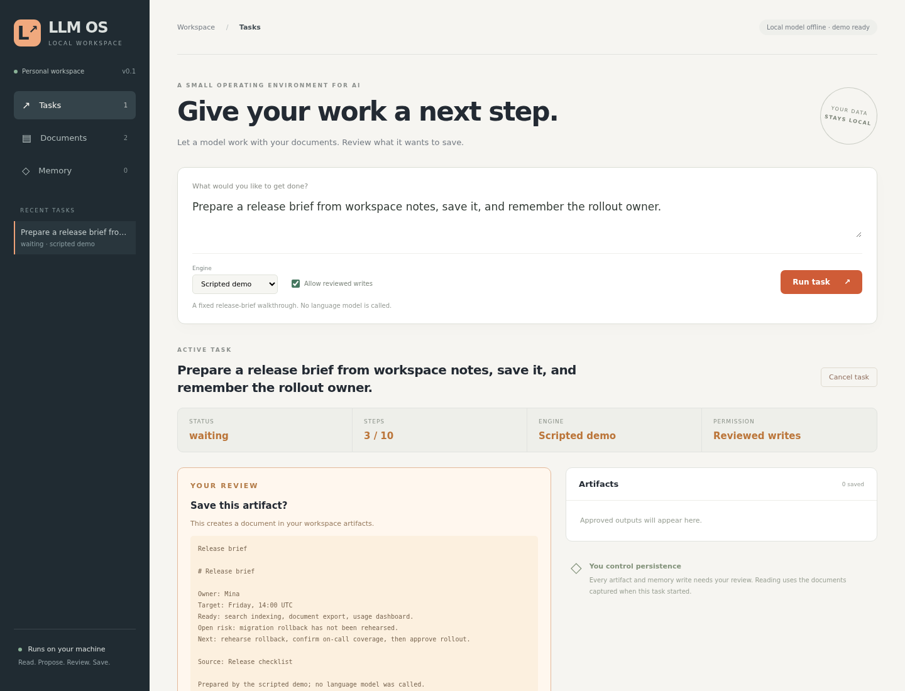

# LLM OS

A local workspace where a language model works with documents, proposes artifacts, and carries
approved facts into later tasks. The application supplies a small kernel: bounded execution,
document snapshots, persistent memory, explicit write review, and an inspectable activity record.
"OS" describes these application primitives; this project runs inside an existing operating system.



The central experiment is a **model-driven action loop**. A local model chooses one typed action,
the kernel validates and executes it, and the next turn sees the observation. Artifact and memory
writes pause for review. The model never receives a Python interpreter, a shell, or arbitrary file
access through this interface.

## Start the workspace

Use Python 3.11+ on Linux, macOS, or WSL. The runtime uses only the standard library.

```bash
git clone https://github.com/leodevnc/llm-os.git
cd llm-os
python3 -m llm_os
```

Open **http://127.0.0.1:8787**. State is stored in `.llm-os/`. You can choose a different directory
with `--data PATH` and a port with `--port 8788`. One server owns a data directory at a time.

The included **Scripted demo** works without a model. It runs a fixed release-brief scenario using
the sample documents. Its text and output explicitly identify the demo; arbitrary requests require
a local model.

1. Select **Run task**. The demo searches and reads the release checklist.
2. Review the proposed brief and choose **Approve & continue**.
3. Review the proposed `release-owner` memory and approve it.
4. Inspect the saved artifact and the Memory tab. Refresh the page to confirm persistence.

Rejecting a write makes the demo stop without making further write requests. Clearing **Allow
reviewed writes** denies writes at the kernel boundary, regardless of the model's proposal.

## Connect a local model

Run an existing Ollama installation with a downloaded local model. Configure Ollama's local-only
mode before using workspace data; for a foreground server this can be:

```bash
OLLAMA_NO_CLOUD=1 ollama serve
```

For an existing service, apply the setting to that service and restart it. See the official
[Ollama local-only configuration](https://docs.ollama.com/faq#how-do-i-disable-ollama-cloud-features).
LLM OS does not install Ollama or download model weights.

Reload the page, select **Local Ollama**, choose an installed model, and enter a task. The adapter
uses `127.0.0.1:11434`, bypasses environment proxies, does not follow redirects, and rejects model
names containing `cloud`. Model-name filtering is a convenience, not proof that an independently
configured Ollama service cannot forward requests; the service's local-only configuration matters.

The request uses Ollama's [chat API](https://docs.ollama.com/api/chat) and
[structured outputs](https://docs.ollama.com/capabilities/structured-outputs), followed by independent
validation in Python. A malformed response fails the task visibly. There is no silent switch to
demo mode. This milestone verified the adapter against a loopback HTTP stub; no Ollama model was
installed on the development machine, so real-model behavior remains unverified.

## What the kernel exposes

| Action | Purpose | Persistence rule |
| --- | --- | --- |
| `search(query)` | Find documents in the task's captured workspace | Read only |
| `read(document_id)` | Read a captured document by ID | Read only |
| `recall(query)` | Read matching current workspace memory with versions | Read only |
| `write(title, content)` | Propose an artifact | Exact content reviewed before save |
| `remember(key, value)` | Propose a persistent fact | Review plus memory-version check |
| `finish(text)` | Complete the task | Save final response and stop |

Tasks have a fixed step budget, two worker slots, and a 60-second socket timeout for local model
requests. Cancellation invalidates an in-flight turn's epoch, so its late response cannot save
an action. On restart, interrupted model turns become runnable again; their consumed step remains
counted. Pending reviews and already approved artifacts survive restart.

## Tests

```bash
python3 -m unittest discover -s tests -v
npm ci
npx playwright install --with-deps chromium
npm run test:e2e
```

Python tests cover execution ownership, cancellation fencing, approval replay, memory conflicts,
snapshot reads, character-budget eviction, malformed actions, the real HTTP adapter boundary, and
local-origin restrictions. Browser tests exercise the two-review workflow, rejected writes,
durable display, mobile width, and literal rendering of document HTML.

## Engineering record

- [Architecture and task state](docs/architecture.md)
- [Decisions and tradeoffs](docs/decisions.md)
- [Test evidence](docs/test-evidence.md)
- [Learning notes](docs/learning-notes.md)
- [Roadmap](docs/roadmap.md)

## Scope

This is a single-user, single-host prototype. Local account access is the trust boundary. The UI
has no authentication or tenant separation. It is bound to loopback and should stay there. The
model's final response is not checked for factual accuracy. Approval controls saving, not truth.
Untrusted document text can still influence a model's proposals within its allowed capabilities.

Context is bounded in characters, not model tokens, and older observations can be omitted. The
database retains the complete record. SQLite data are unencrypted, and retention/deletion controls
are future work. There is no MCP bridge, multi-agent scheduler, vector database, remote service
integration, or arbitrary code sandbox in this milestone.

## License

MIT
