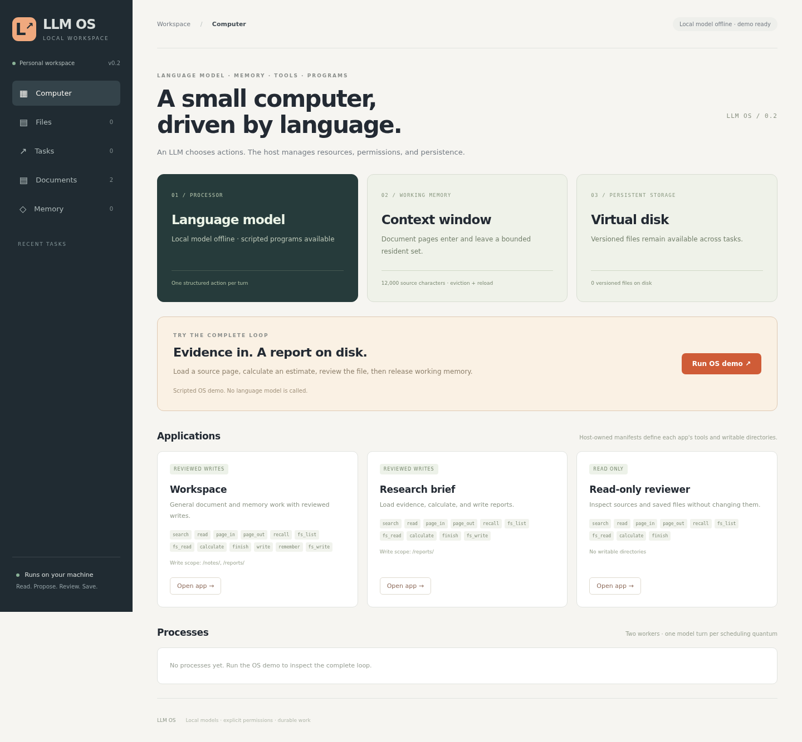

# LLM OS

A local operating environment where a language model chooses actions, loads evidence into working
memory, uses tools, and saves reviewed work to a versioned virtual disk. A small host kernel owns
permissions, scheduling, context residency, and persistence.

Inspired by Andrej Karpathy's [LLM OS framing](https://www.youtube.com/watch?v=zjkBMFhNj_g&t=2535s):
the model is analogous to a processor, its context to working memory, and tools and storage extend
what it can do. This is our bounded software interpretation, not a reproduction of a prescribed
architecture. It runs **inside** Linux, macOS, or WSL; it is not a bootable OS or a device controller.



## What runs today

| Component | Implemented behavior |
| --- | --- |
| Processor | Local Ollama chooses one typed action per turn |
| Working memory | `page_in` / `page_out`, a 12,000-source-character resident set, eviction and reload |
| Persistent storage | Virtual files with version history; approved facts in shared memory |
| Classical computation | Bounded arithmetic without Python evaluation or shell access |
| Applications | Workspace, Research brief, Read-only reviewer; host-owned tool and write scopes |
| Processes | Durable tasks, two worker slots, one-turn cooperative scheduling, cancellation fencing |
| Human control | Exact-content write review and stale-version conflict detection |

The model proposes actions; the host enforces the boundaries. No arbitrary code execution, host
filesystem access, device drivers, cloud calls, or paid infrastructure is wired into the tools.

## Try the complete loop

Use Python 3.11+. The runtime uses only the standard library.

```bash
git clone https://github.com/leodevnc/llm-os.git
cd llm-os
python3 -m llm_os
```

Open **http://127.0.0.1:8787** and select **Run OS demo**.

1. The program searches the release checklist and pages it into working memory.
2. The arithmetic tool computes `18 * 7 + 24 = 150`.
3. Review the exact proposed file at `/reports/release-brief.md`; approve or reject it.
4. On approval, the file is saved, the source page is released, and the task finishes in six turns.
5. Open **Files** to inspect the persisted result. Later tasks can read it with `fs_read`.

**This walkthrough is explicitly scripted; it does not call an LLM.** It exercises the real kernel,
pager, calculator, approval transaction, and filesystem. The separate Scripted release demo still
demonstrates artifact and persistent-memory review. Arbitrary goals require a local model.

State lives in `.llm-os/`. Use `--data PATH` and `--port 8788` to change it. One server owns a data
directory at a time. Existing v0.1 workspaces receive additive tables and an app-manifest column;
old tasks retain Workspace capabilities.

## Connect a local model

Run an existing Ollama installation with downloaded local model weights. Configure the service's
local-only mode before providing workspace data:

```bash
OLLAMA_NO_CLOUD=1 ollama serve
```

For a running service, apply the setting to that service and restart it. See
[Ollama local-only configuration](https://docs.ollama.com/faq#how-do-i-disable-ollama-cloud-features).
LLM OS does not install Ollama or download weights.

Reload the page and open an app, or select **Local Ollama** in Tasks. Choose an installed model and
enter a goal such as: "Read the release checklist, compute 18 * 7 + 24, and save a report."
Research brief can save under `/reports/`; Read-only reviewer cannot save anything.
All apps currently share read access, so these scopes are **not tenant isolation**.

The adapter uses `127.0.0.1:11434`, bypasses environment proxies, does not follow redirects, and
rejects names containing `cloud`. Name filtering does not prove an independently configured
Ollama service is local; its configuration matters. Requests use the
[chat API](https://docs.ollama.com/api/chat) and
[structured outputs](https://docs.ollama.com/capabilities/structured-outputs), with independent
Python validation. Provider failure never silently switches to a demo.

**No local model was installed during verification.** The HTTP adapter was tested against a
loopback stub, not live inference. Model tool selection, model-specific schema support, and answer
quality remain unverified.

## Kernel interface

| Actions | Contract |
| --- | --- |
| `search`, `read` | Read immutable source documents captured when the task starts |
| `page_in`, `page_out` | Retain or release source documents in subsequent model contexts |
| `fs_list`, `fs_read` | Inspect current shared virtual files |
| `fs_write` | Review exact content; check app path scope and expected file version |
| `calculate` | Numbers, parentheses, and `+ - * /`; bounded complexity and magnitude |
| `recall`, `remember` | Read shared facts; review and version-check updates |
| `write` | Review a task artifact, kept separately from the shared virtual disk |
| `finish` | Store a final response and stop |

Resident source content and observation history share an 18,000-character payload allowance;
resident source content is capped at 12,000. This is **not** a token budget or a bound on the entire
serialized request. Instructions, inventory, framing, and escaping add overhead.

## Verify locally

```bash
python3 -m unittest discover -s tests -v
npm ci
npx playwright install --with-deps chromium
npm run test:e2e
```

Tests exercise eviction/reload, app enforcement, path validation, arithmetic restrictions, atomic
file writes, conflicting reviews, historical file versions, cooperative scheduling, migration,
cancellation/recovery, the HTTP adapter, and browser workflows.

## Engineering record

- [Karpathy framing and implementation map](docs/karpathy-llm-os.md)
- [Architecture and task state](docs/architecture.md)
- [Decisions and tradeoffs](docs/decisions.md)
- [Test evidence](docs/test-evidence.md)
- [Learning notes](docs/learning-notes.md)
- [Roadmap](docs/roadmap.md)

## Limits

Single user, single host, loopback only. There is no authentication, multi-user isolation, hard
preemption, end-to-end model deadline, or adversarial code sandbox. SQLite data are unencrypted;
retention and deletion controls are not implemented. Task/file history can grow without quota.
A 60-second socket timeout limits stalled I/O, not total request duration.

Source pages use task snapshots; files and memory are live shared state. Eviction releases a page
from the next context, not from the database or model server's own internal caches. Untrusted text
can influence model proposals. Approval authorizes saving; it does not establish truth or defeat
prompt injection. There is no MCP bridge, remote integration, device control, or automatic subagent
creation in this milestone.

## License

MIT
